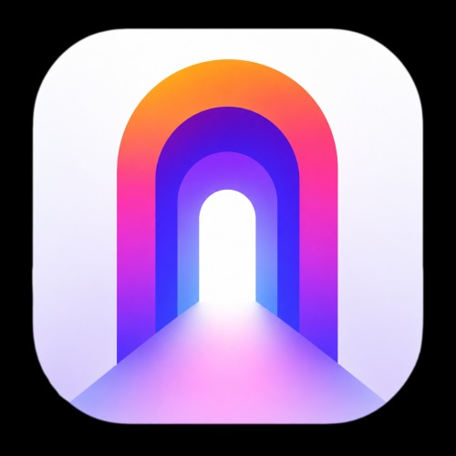

  

# Openhub Android

  <b>Tech Events in One Place</b>

  An immersive directory with <i>Spatial UI</i> and <i>Liquid Glass</i> design to connect the global developer community from the palm of your hand.

  
  
  

 

## 🔭 The Problem
The tech community faces a disconnect in event discovery. Although there are hundreds of conferences, hackathons, and meetups, finding them from a mobile device is often a static and complicated experience.

<table width="100%">
  <tr>
    <td width="33%" valign="top">
      <h3 align="center">🧩 Fragmentation</h3>
      
Tech events are scattered across multiple isolated platforms or private groups.

    </td>
    <td width="33%" valign="top">
      <h3 align="center">🔊 Digital Noise</h3>
      
Irrelevant information overload causes developers to miss real networking opportunities.

    </td>
    <td width="33%" valign="top">
      <h3 align="center">🎯 Lack of B2B Focus</h3>
      
Lack of mobile platforms that allow efficient filtering by technical level, stack, or audience type.

    </td>
  </tr>
</table>

 

## 💡 The Solution
Openhub is a centralized native Android app that serves as an interactive directory. Forget the digital noise and never miss a networking opportunity again.

### Key Features
1. **Central Directory:** Filter by category, date, or location, and explore the ecosystem visually.
2. **Boost your events:** Find global conferences with immersive descriptions.
3. **Spatial UI:** A premium native interface based on Liquid Glass, Shared Elements transitions, and fluid 60fps animations inspired by iOS 26.

 

## ⚙️ Tech Stack
Mobile architecture designed for fluid interfaces, immersive animations, and maximum performance.

| **Component** | **Technology** | **Description** |
| :--- | :--- | :--- |
| **Frontend** |   | Native Android with Kotlin and Jetpack Compose for a reactive, modern architecture. |
| **Animations** |  | Compose Animation API and `Modifier.graphicsLayer` for the glass physics engine and GPU-backed transitions. |

 

## 🗺️ Roadmap
- [x] **Base Architecture:** Android Studio + Kotlin + Jetpack Compose setup.
- [x] **Spatial UI System:** `liquid-glass` style engine and ultra-optimized frosted animations.
- [x] **Fluid Splash Screen:** Entry/exit animations integrated with the native Android 12+ system.
- [x] **Interactive Dashboard:** Event panel with frosted bottom navbar and cascading card transitions.
- [x] **Detail Animations:** Smooth Apple-style shared element transitions (text and image).
- [ ] **Backend Integration:** Database connection (PostgreSQL/Firebase) for dynamic ingestion.
- [ ] **Auth System:** Login and profile management for developers.

 

## 🤝 Acknowledgments
- To the Android Open Source community for providing key libraries like Coil and Haze.
- To the creators of spatial interfaces who inspire the future of mobile design.

 

  Built with ❤️ for the global developer community.

